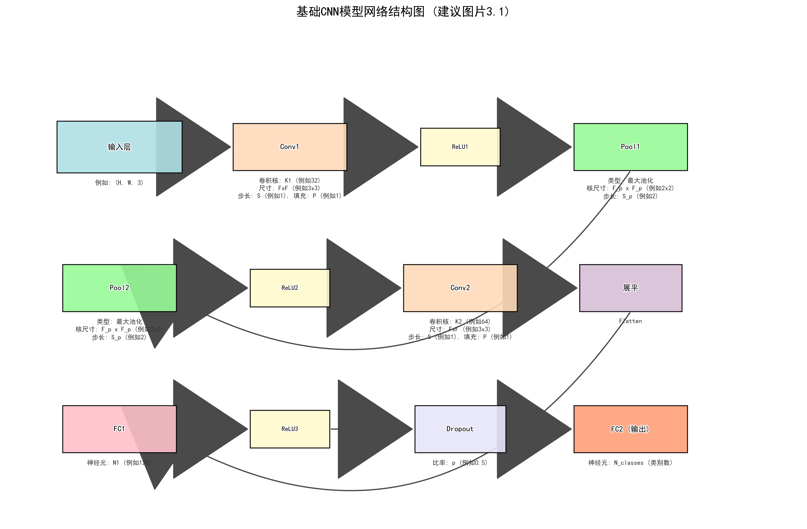
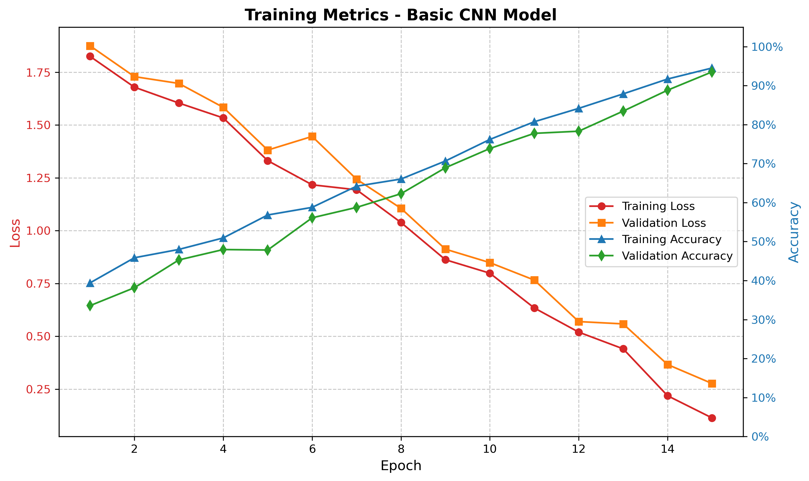
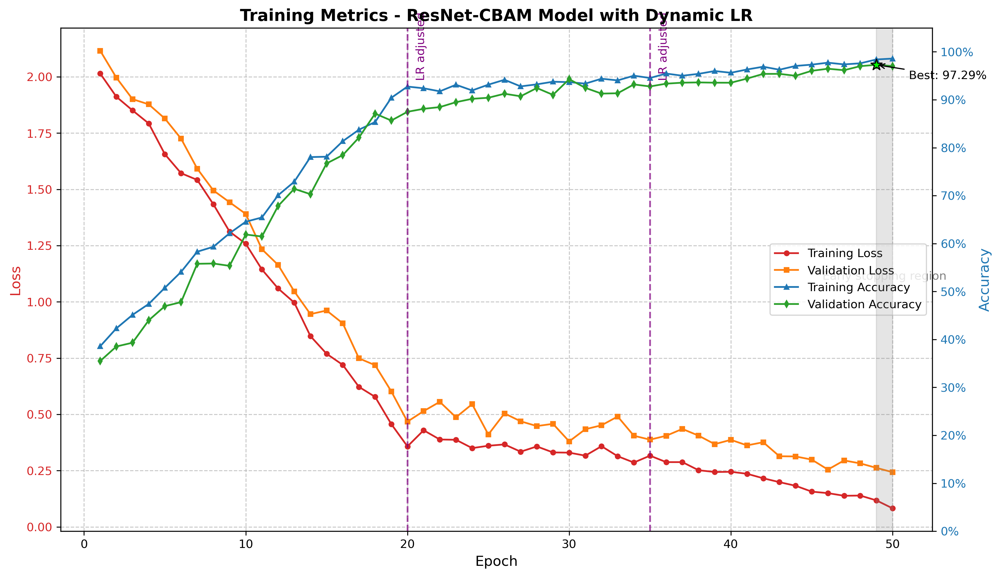
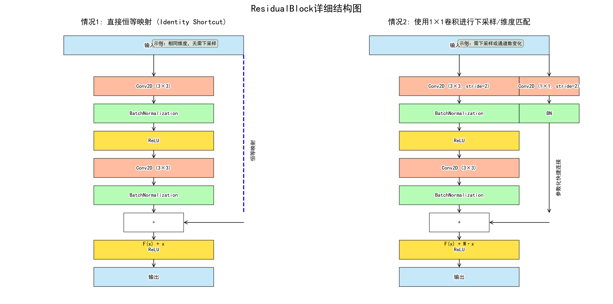

# 基于CNN与CBAM的飞行器目标识别系统

[](https://pytorch.org/)
[](https://www.python.org/)
[](#license)

> 🎓 南京工业大学 2025 届本科毕业设计 — 李业伟

## 📖 项目简介

本项目源于本科毕业设计研究，旨在探究**卷积神经网络（CNN）**在飞行器目标识别任务中的应用，并通过引入**残差连接（Residual Connections）**和**卷积块注意力模块（CBAM）**来提升模型性能。

项目包含两个模型：

| 模型 | 描述 | 测试准确率 | 参数量 | 训练脚本 |
|------|------|-----------|--------|----------|
| **基础 CNN** | 简洁的双卷积块架构，用于验证 CNN 的可行性 | **92.26%** | ~5.02 MB | `newtrain-basic.py` |
| **ResNet + CBAM** | 融合残差连接与注意力机制的改进模型 | **97.59%** | ~2.82 MB | `newtrain2.py` |

> 改进模型在准确率提升 **5.33%** 的同时，参数量减少了 **43.8%**，实现了高精度与轻量化的双目标。

---

## 🎯 核心特点

- ✅ 自建四类飞行器图像数据集（军用飞机、民航客机、无人机、直升机）
- ✅ 系统化的数据预处理与质量筛选流程
- ✅ 基础 CNN 模型设计与实现
- ✅ 融合残差连接与 CBAM 注意力机制的改进模型
- ✅ 动态学习率调整与早停策略
- ✅ 完整的训练-验证-测试评估框架
- ✅ 多维度性能指标（准确率、精确率、召回率、F1、混淆矩阵）
- ✅ 模型结构可视化与训练过程图表

---

## 📊 数据集

实验数据集包含四个飞行器类别，来源于 Kaggle 公开数据集，划分如下：

| 类别 | 英文标签 | 训练集 | 验证集 | 测试集 |
|------|---------|--------|--------|--------|
| 军用飞机 | Military Aircraft | - | - | - |
| 民航客机 | Civil Airliner | - | - | - |
| 无人机 | UAV/Drone | - | - | - |
| 直升机 | Helicopter | - | - | - |
| **总计** | | **15,104** | **2,000** | **1,990** |

数据集采用以下预处理策略：
- **尺寸归一化**：统一缩放至 140×140 像素
- **标准化**：ImageNet 标准均值与标准差
- **数据增强**：随机水平翻转、随机旋转（±15°）、随机仿射变换
- **质量筛选**：自动检测并移除低质量/噪点图像

---

## 🏗️ 模型架构

### 基础 CNN 模型

```
Input (140×140×3)
  ├── Conv Block 1: Conv(3→16, 3×3) → ReLU → MaxPool(2×2)
  ├── Conv Block 2: Conv(16→32, 3×3) → ReLU → MaxPool(2×2)
  └── Classifier: Flatten → FC(128) → Dropout(0.25) → FC(4)
```



### 改进模型：ResNet + CBAM

在基础 CNN 上引入：
- **残差块（Residual Block）**：3 层级联残差层，总通道数 64→128→256
- **CBAM 注意力模块**：通道注意力 + 空间注意力串行组合
- **全局平均池化**：替代传统全连接层，减少参数量
- **7×7 初始卷积**：更大的感受野捕获全局信息

> 残差连接通过快捷路径缓解梯度消失问题，使更深网络得以有效训练。
> 
> CBAM 模块引导网络同时学习"关注什么特征"和"在哪里寻找特征"。

---

## 📈 实验结果

### 模型性能对比

| 指标 | 基础 CNN | ResNet + CBAM | 提升 |
|------|----------|--------------|------|
| **测试准确率** | 92.26% | **97.59%** | +5.33% |
| **验证最优准确率** | - | 97.80% | - |
| **模型参数量** | 5.02 MB | **2.82 MB** | -43.8% |
| **训练耗时** | ~9 min | ~53 min | - |

### 训练过程可视化

**基础 CNN 训练指标：**



**改进模型训练指标：**



**残差块结构：**



---

## 🚀 快速开始

### 环境要求

- Python 3.6+
- PyTorch（推荐从 [官网](https://pytorch.org/get-started/locally/) 安装）
- 其他依赖：
  ```bash
  pip install opencv-python pillow numpy matplotlib seaborn scikit-learn tqdm
  ```

### 数据集准备

将数据集按以下结构放置在 `aircraft_dataset/` 目录下：

```
aircraft_dataset/
├── train/
│   ├── military_aircraft/
│   ├── civil_airliner/
│   ├── uav/
│   └── helicopter/
├── val/
└── test/
```

运行数据预处理与质量筛选：

```bash
python dataset.py
```

### 训练模型

**训练基础 CNN 模型：**

```bash
python newtrain-basic.py
```

**训练改进的 ResNet-CBAM 模型：**

```bash
python newtrain2.py
```

### 模型推理

使用训练好的模型对新图像进行预测：

```bash
python predict.py --image_path path/to/image.jpg --model_path newmodels-resnet/checkpoints/best_model.pth
```

---

## 📂 项目结构

```
Aircraft-Recognition-Based-on-CNN-and-CbAM/
│
├── 核心训练/
│   ├── newtrain-basic.py        # 基础 CNN 模型训练
│   └── newtrain2.py             # ResNet-CBAM 改进模型训练
│
├── 数据处理/
│   ├── dataset.py               # 数据集构建与质量筛选
│   ├── dataset-expand.py        # 数据集扩展
│   ├── dataset-improve.py       # 数据集改进
│   ├── dataset-improve2.py      # 数据集改进（增强版）
│   ├── dataset-val.py           # 验证集处理
│   ├── merge_val_to_train.py    # 合并验证集到训练集
│   ├── check_duplicate_images.py # 重复图像检查
│   └── check_similar_images.py  # 相似图像检查
│
├── 模型预测/
│   └── predict.py               # 模型推理与预测
│
├── 可视化/
│   ├── generate_cnn_structure.py          # CNN 结构图生成
│   ├── generate_residual_block.py         # 残差块结构图
│   ├── generate_resnet_cbam_metrics.py    # ResNet-CBAM 指标图
│   ├── generate_training_metrics_english.py # 训练指标（英文）
│   └── resnet_cbam_structure_plot.py     # ResNet-CBAM 结构图
│
├── 结果输出/
│   ├── newmodels-basic/         # 基础模型训练结果
│   │   ├── checkpoints/         # 模型权重
│   │   ├── logs/                # 训练日志
│   │   ├── results/             # 分类报告
│   │   ├── accuracy_info.txt    # 准确率信息
│   │   └── model_architecture.json # 模型架构
│   │
│   └── newmodels-resnet/        # 改进模型训练结果
│       ├── checkpoints/         # 模型权重
│       ├── logs/                # 训练日志
│       ├── results/             # 分类报告
│       ├── accuracy_info.txt    # 准确率信息
│       └── model_architecture.json # 模型架构
│
├── 数据集/
│   └── aircraft_dataset/        # 飞行器图像数据集
│
├── 文档/
│   └── 基础模型详解.txt          # 基础 CNN 模型详细说明
│
├── README.md                    # 项目说明
└── .gitignore                   # Git 忽略规则
```

---

## 🛠️ 技术栈

| 技术 | 用途 |
|------|------|
| Python 3 | 编程语言 |
| PyTorch | 深度学习框架 |
| CUDA / cuDNN | GPU 加速 |
| OpenCV / PIL | 图像处理 |
| NumPy | 数值计算 |
| Matplotlib / Seaborn | 数据可视化 |
| tqdm | 进度显示 |

---

## 🎯 应用场景

- 🛡️ **军事侦察**：自动识别敌方飞行器类型
- ✈️ **航空安全**：机场周边空域监控
- 🚁 **无人机监管**：民用无人机目标识别
- 📹 **智能监控**：重点区域空中目标检测

---

## 📝 参考文献

本研究的理论基础参考文献详见毕业设计论文，核心参考包括：

1. He, K., Zhang, X., Ren, S., & Sun, J. (2016). *Deep Residual Learning for Image Recognition.* CVPR 2016.
2. Woo, S., Park, J., Lee, J. Y., & Kweon, I. S. (2018). *CBAM: Convolutional Block Attention Module.* ECCV 2018.
3. 周飞燕, 金林鹏, 董军. 卷积神经网络研究综述. 计算机学报, 2017.
4. 谷虹娴. 基于深度卷积神经网络的空中飞行器图像识别. 西安工业大学, 2021.

---

## ⚠️ 注意事项

- 本项目为学术研究性质，数据集仅供学习研究使用
- 模型权重文件（`.pth`）较大，未包含在版本控制中，训练后自动生成
- 数据集图像文件未上传至 GitHub，请自行准备或替换为公开数据集
- 实验在 Windows 11 + CUDA 环境下进行，推荐使用 GPU 加速训练

---

## 📄 License

MIT License

---

## 👤 作者

**李业伟 (lyw-12)**

- GitHub: [@lyw-12](https://github.com/lyw-12)
- 毕业设计导师：姜华
- 南京工业大学 · 数据科学与大数据技术 2101

---

*如果这个项目对你有帮助，欢迎给个 ⭐️！*
